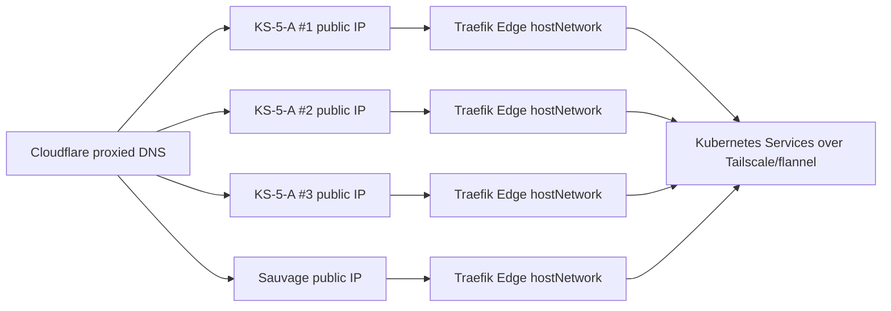

# KS-5 HA Architecture

## Current State

- k3s `v1.32.5+k3s1`.
- `ubuntu` x86 is the only control-plane/etcd node.
- `sauvage` is the public edge worker with Traefik Edge running as a
  hostNetwork DaemonSet.
- Private node connectivity uses Tailscale; current Kubernetes node InternalIPs
  are Tailscale `100.x` addresses.

## Target State

- `ks5-cp-1`, `ks5-cp-2`, `ks5-cp-3`: KS-5-A dedicated servers in OVH
  Roubaix (`rbx8` from delivered services).
- Each KS-5-A must match:
  - CPU: Intel Xeon E-2274G.
  - RAM: 32GB DDR4 ECC included.
  - Storage: 2x SSD NVMe 960GB Enterprise Class Soft RAID included.
  - OS: Ubuntu Server 24.04 LTS.
- The three KS-5-A nodes become the only k3s server/etcd members.
- `ubuntu` becomes a tainted worker for development, dashboards, experiments and
  LLM/dev services only.
- `sauvage` remains heavy worker plus public edge for bulk/heavy production
  services that do not require NVMe.
- Fast stateful production workloads use the KS-5 NVMe pool.
- Traefik Edge runs on all nodes with `ingress=true`: three KS-5-A nodes plus
  Sauvage.
- Cloudflare publishes multiple A records to the four public edge IPs.

## Traffic Flow

## Failure Model

- One KS-5-A can fail while k3s etcd keeps quorum.
- One public edge IP can fail while Cloudflare still has other A records.
- Multi-A does not provide health-based removal; use Cloudflare Load Balancer in
  the future if active origin failout is required.
